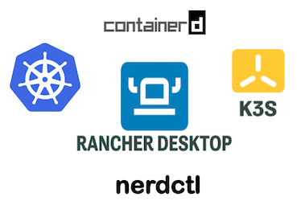

<p align="center">
  <a href="" rel="noopener">
 </a>
</p>

<h3 align="center">Rancher Desktop + kubernetes (k3s) + nerdctl</h3>

<div align="center">

[]()
[](/LICENSE)

</div>

<!-- <p align="center">
  <a href="" rel="noopener">
 </a>
</p> -->
---

<p align="center"> Projeto de React em ambiente de kubernetes
    <br> 
</p>

## 📝 SUMÁRIO

- [About](#about)
- [Getting Started](#getting_started)
- [Deployment](#deployment)
- [Usage](#usage)
- [Built Using](#built_using)
- [TODO](../TODO.md)
- [Contributing](../CONTRIBUTING.md)
- [Authors](#authors)
- [Acknowledgments](#acknowledgement)

## 🧐 About <a name = "about"></a>

Ambiente mais +simples, +facil, +otimizado.

O Rancher Desktop é um ambiente de Kubernets onde voce pode escolher o CRI nerdctl. O Rancher Desktop  utiliza o K3S que é mais leve que o kubernets (K8S) tradicional.

## 🏁 Getting Started <a name = "getting_started"></a>

- 1 Instalação do Rancher Desktop
- 2 Baixar respositorio
- 3 Fazer o deploy
- 


### RANCHER DESKTOP
<p align="center">
  <a href="" rel="noopener">
 </a>
</p> -->

- 1 Acesse a página de downloads no GitHub.
  - link: https://github.com/rancher-sandbox/rancher-desktop/releases
  - ou pagina home: https://rancherdesktop.io/
- 2 Encontre a versão do Rancher Desktop que você deseja baixar. 


```
Give examples
```

### COMANDOS :blue_square:  :whale: nerd_face: 


- Container management
  - :whale: ```nerdctl run``` : 
  - :whale: ```nerdctl exec``` : 
  - :whale: ```nerdctl ps``` : 
  - :whale: ```nerdctl rm``` : 
  - :whale: ```nerdctl restart``` : 
  - :whale: ```nerdctl run``` : 
  - :whale: ```nerdctl run``` : 
  - :whale: ```nerdctl run``` :  
  - :nerd_face: asd

## 🔧 Running the tests <a name = "tests"></a>

E
## Links <a name = "link"></a>

- [MongoDB](https://www.mongodb.com/) - Database
- [Express](https://expressjs.com/) - Server Framework
- [VueJs](https://vuejs.org/) - Web Framework
- [NodeJs](https://nodejs.org/en/) - Server Environment

🎉 ✍️ ⛏️ 🚀 🔧